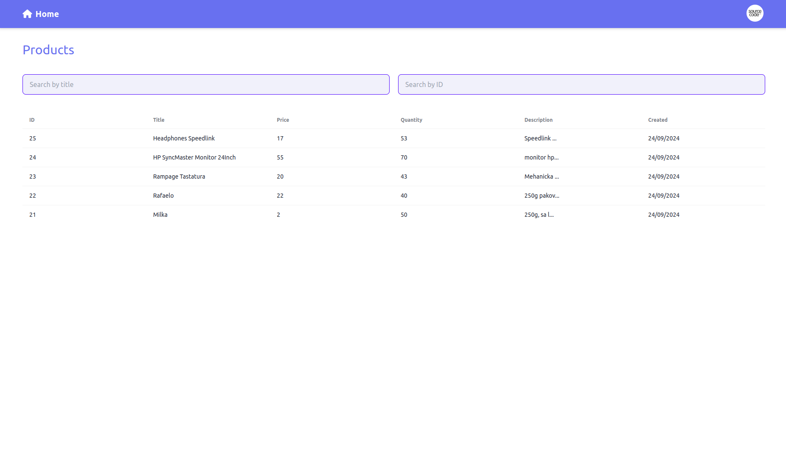
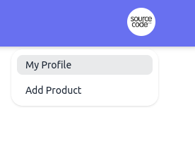
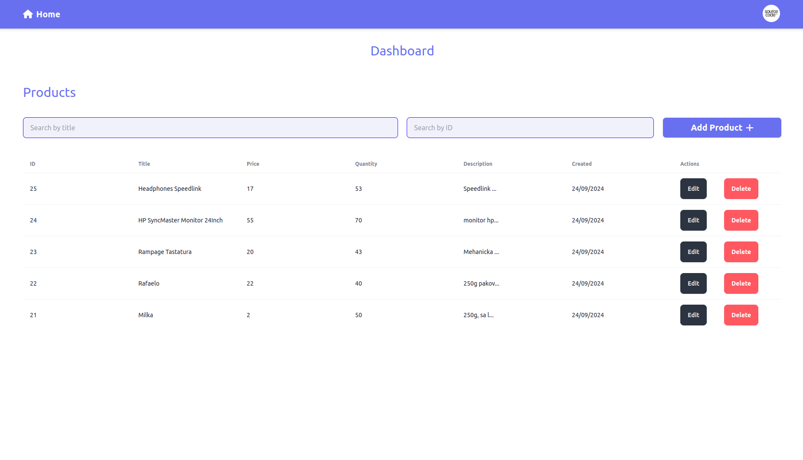
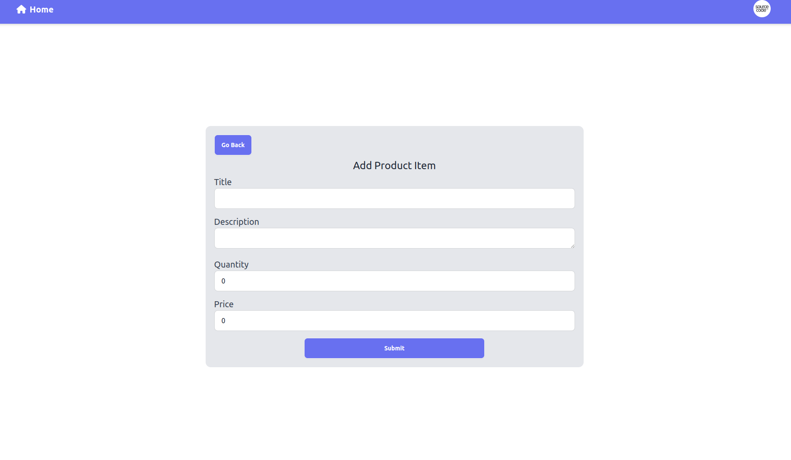
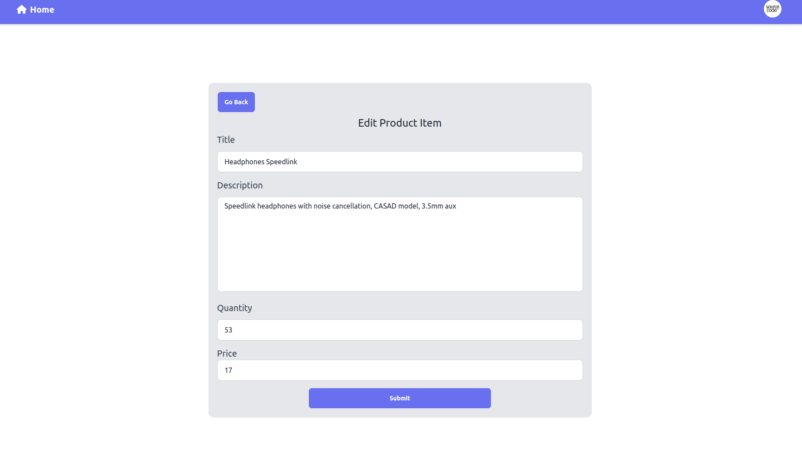

# VueJS Product List Item Simple App

Simple CRUD project done for interview purposes.

App has following functions: Add Products, Geting all products, deleting item, updating and searching via text search input.

Tools which are used here:

<b>Frontend:</b> VueJS, Tailwind, Toast (nofitications) DaisyUI, Fontawesome, axios  
<b>Backend: </b> Golang (Go)  
<b>Database: </b> PostgreSQL

## Requirements to start project

- NodeJS (18 or higher)
- VueCLI
- Docker (for starting postgres and golang backend)

## Steps for starting this project

### 1. Cloning project

Clone it via this link: git@github.com:DenisKantic/vuejs_demo_project_golang_postgres.git (if you are using SSH github)

If you don't use SSH connection type, you can use simple https link:
https://github.com/DenisKantic/vuejs_demo_project_golang_postgres.git

### 2. Setting up project

After cloning the project, execute command just in case  

<b>git pull origin main</b>  

After that, run

<b>npm install</b>

to install node modules.

After that, start your Vue project on localhost (npm run dev)

### 3. Starting up Backend and PostgreSQL

Since postgres is connected in compose.yaml with docker volume "productdata", you will need to create one.

<b>docker volume create productdata</b>  

To start golang and postgres at the same time, go to the root directory of the project where is
"compose.yaml" located and run the command "docker compose up".

You can run "docker compose up --d" to run it in "detach mode", so you can have your terminal free.

### 4. Creating store procedures in PostgreSQL

Since I'm not importing docker volume, you will need to manually create store procedures. You will find them inside /backend/README.md.

Copy and paste them inside running postgres container.

### 5. Use your app

If you done all of these steps, you are ready to use this application.

# Walktrough in this app

## Homepage

In the homepage, you will see this screen (this is demo example with some created data list)

For "guest" users, they will have 2 options. One is search items by "title" or search items by "ID".
 

As you can see, in the list you will have title and ID, which you can use to search for it.

## Dashboard page

To enter to the dashboard page, you will need to click on circle shaped button on the top right navigation. You will have dropdown with two options

- My Profile (is your dashboard)
- Add Product (is your shortcut to create right away new product)

 

this is your dashboard page.

Here you have extra options, like Add Product, Edit or Delete item from the list.

## Add Product Item

This is simple form for inserting values for creating your product

Insert your values and click submit. That's it. Very simple.

If your form is okay, it will show toast notification that is successfully created and it will redirect you to the "myProfile" route, which is dashboard.

If not, you will see toast notification in red with the error message.

## Edit Product Item

When you click in the list on the button "edit", it will redirect you to the new page with same form design, but with existing values inside the form. You can edit whatever you want. Only title or change every field.

